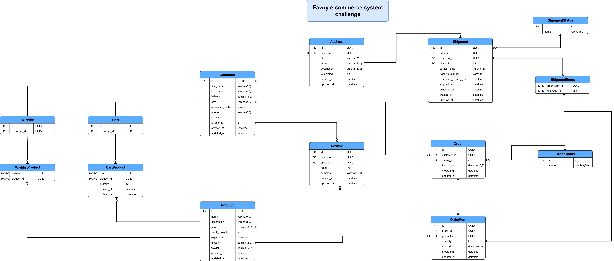

# Fawry E-Commerce Challenge
Designing an e-commerce system for Fawry Rise Journey Internship Challenge.

>### ⚠️ Note:
>#### This project is not fully complete due to time constraints. Several components are still missing, including:
>
>- DTOs for most entities  
>- Input validations  
>- Additional business logic for some entities (not required in the challenge, but planned for future implementation)  
> 💡 **For more details**, feel free to check out my other e-commerce project built with C# and .NET:  
> 👉 [Overclocked Repository](https://github.com/TarekMohame-d/Overclocked)

## 🗂️ Entity Relationship Diagram (ERD)

